<!-- 
  ✨ DEVANSH'S PROFILE ✨
-->

<div align="center">
  <!-- Typing SVG: Dynamic, no setup needed -->
  <a href="https://git.io/typing-svg">
    
  </a>
</div>

<!-- Header Image / Gif -->
<div align="center">
  
</div>

---

### ⚡ The Vibe

```python
class Devansh:
    def __init__(self):
        self.role = "Advisory Intern @ PwC (Cyber Risk)"
        self.location = "Dehradun, India"
        self.skills = ["Machine Learning", "Cyber Security", "Computer Vision"]
        self.hobbies = ["Gaming 🎮", "Anime ⛩️", "Movies 🍿"]
        
    def current_status(self):
        return "Building Smart Systems & Exploring New Perspectives"
```

---

### 🛠️ Arsenal

<div align="center">
  <!-- Strict Resume Match + Node.js -->
  
</div>

---

### 🚀 Featured Projects

| Project | Description | Tech Stack |
| :--- | :--- | :--- |
| **🕵️ Image Steganography** | Cybersecurity tool to hide encrypted messages within images. | `Python` `Cryptography` |
| **🧠 Brain Tumor Detection** | Deep Learning model for classifying tumors in MRI scans. | `TensorFlow` `CNN` `NumPy` |
| **😴 Drowsiness Detection** | Real-time driver safety system using facial landmarks. | `OpenCV` `Dlib` `Python` |
| **🖼️ Image Classification** | High-accuracy CNN trained on CIFAR-10 & MNIST. | `Keras` `Deep Learning` |

---

### 🏆 Achievements & Certifications

- 🎖️ **PwC Cyber Risk & Regulatory Launchpad**
- 🧩 **Solved 200+ Algorithmic Challenges** (Competitive Coding)
- 📜 **Machine Learning with Python** (Coursera)
- 💻 **C++ Programming: Beginning to Beyond** (Udemy)

---

### 📊 The Numbers

<div align="center">
  <!-- Metrics: Replaces broken github-readme-stats -->
  
</div>

---

<div align="center">
  <!-- Footer -->
  <a href="https://www.linkedin.com/in/devansh-sharma-742a99337/">
    
  </a>
  <a href="mailto:devanshsanjeevsharma@gmail.com">
    
  </a>
</div>
